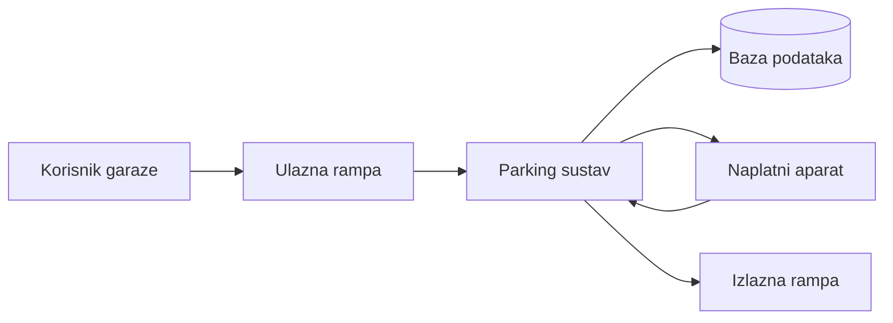
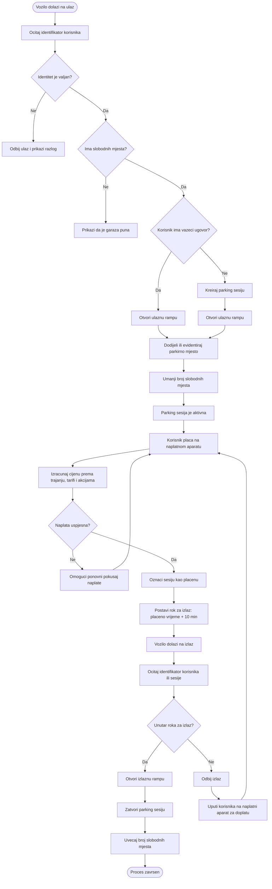
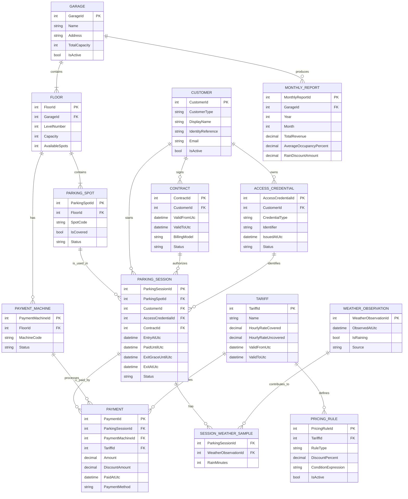

# Zadatak 2 - Sustav za vodjenje parkiralista

## Cilj sustava

Potrebno je osmisliti sustav za vodjenje garaze koji omogucuje naplatu parkiranja prema vremenu zauzetosti parkirnog mjesta, kontrolu ulaza i izlaza, pracenje slobodnih mjesta te mjesecni uvid u poslovanje garaze.

Sustav mora podrzavati placanje na naplatnim aparatima po katovima, ugovorne korisnike, zabranu placanja na izlazu, pravilo da korisnik ima 10 minuta za izlaz nakon placanja te posebnu akciju u kojoj su nenatkrivena mjesta u kisnim uvjetima 50% jeftinija ako je vozilo barem 33% parkiranog vremena bilo na kisi.

Najkriticniji dio sustava je naplata parkiranja. Funkcionalnosti poput kisne akcije i prikaza slobodnih mjesta po katu su korisne, ali ne smiju ugroziti stabilnost naplate, evidenciju ulaza/izlaza i osnovnu kontrolu pristupa.

## Kljucni dijelovi sustava

| Dio sustava | Odgovornost |
| --- | --- |
| Ulazna rampa | Identifikacija korisnika, provjera kapaciteta, otvaranje ulaza i kreiranje parking sesije. |
| Izlazna rampa | Provjera placanja, provjera roka od 10 minuta nakon placanja i zatvaranje parking sesije. |
| Naplatni aparat | Izracun cijene, provjera aktivne sesije, provedba placanja i izdavanje potvrde. |
| Backend/API | Centralna poslovna logika za sesije, naplatu, tarife, ugovore, kapacitete i izvjestaje. |
| Baza podataka | Trajna pohrana garaze, katova, mjesta, korisnika, sesija, uplata, tarifa i izvjestaja. |
| Modul za tarife | Pravila obracuna cijene, ugovorni modeli, popusti i buduce akcije. |
| Weather servis | Evidencija kisnih razdoblja za obracun popusta na nenatkrivenim mjestima. |
| Reporting modul | Mjesecni izvjestaji o prihodu, popunjenosti, ugovornim korisnicima i isplativosti akcija. |
| Admin sucelje | Upravljanje garazom, parkirnim mjestima, tarifama, ugovorima i pregled izvjestaja. |
| Display slobodnih mjesta | Prikaz ukupnog broja slobodnih mjesta i, po mogucnosti, slobodnih mjesta po katu. |

## Prioriteti zahtjeva

| Prioritet | Zahtjev | Obrazlozenje |
| --- | --- | --- |
| Kriticno | Naplata parkiranja | Prihod garaze i izlaz vozila ovise o ispravnoj naplati. |
| Kriticno | Evidencija ulaza i izlaza | Bez pouzdane sesije nije moguce tocno naplatiti parking. |
| Kriticno | Identitet korisnika | Klijent izricito trazi osiguranje identiteta korisnika garaze. |
| Visoko | Ukupan broj slobodnih mjesta | Potencijalnim korisnicima je vazno znati ima li mjesta u garazi. |
| Srednje | Broj slobodnih mjesta po katu | Korisno za navigaciju, ali nije primarni proces. |
| Srednje | Mjesecni izvjestaji | Vazno za vlasnika i poslovnu analizu rada garaze. |
| Nize | Kisna akcija | Korisna marketinska akcija, ali ne smije ugroziti osnovni proces naplate. |

## Kljucni procesi

1. Ulazak vozila u garazu i pokretanje parking sesije.
2. Evidencija zauzimanja parkirnog mjesta i azuriranje kapaciteta.
3. Obracun cijene prema trajanju parkiranja, tipu mjesta, tarifi i mogucim akcijama.
4. Placanje na naplatnom aparatu ili obracun prema ugovoru.
5. Izlazak iz garaze unutar 10 minuta nakon placanja.
6. Dodatna naplata ako korisnik zakasni s izlazom nakon placanja.
7. Prikupljanje podataka za mjesecne izvjestaje i poslovnu analizu.

## Otvorena pitanja i pretpostavke

Specifikacija ostavlja nekoliko detalja otvorenima. U nastavku su navedene pretpostavke koje se koriste za idejno rjesenje, uz pitanja koja bi trebalo potvrditi s klijentom prije detaljne implementacije.

| Tema | Pretpostavka / pitanje |
| --- | --- |
| Identifikacija korisnika | Pretpostavlja se da se korisnik identificira karticom, ticketom, QR kodom ili registarskom oznakom. Tocan mehanizam treba potvrditi. |
| Placanje na izlazu | Placanje na izlazu nije dopusteno. Izlazna rampa samo provjerava status placanja i rok za izlaz. |
| Ugovorni korisnici | Ugovorni korisnici mogu imati drugaciji model naplate, npr. mjesecni obracun, pretplatu ili dodijeljena prava pristupa. |
| Dodjela mjesta | Sustav moze pratiti tocno parkirno mjesto ili samo kat/zonu. Za kisni popust treba znati je li mjesto natkriveno. |
| Kisni podaci | Pretpostavlja se integracija s vremenskim servisom ili lokalnim senzorom kise. Potrebno je definirati izvor istine za kisne intervale. |
| Slobodna mjesta po katu | Prikaz po katu je pozeljan, ali nije kritican. Ukupan broj slobodnih mjesta ima veci prioritet. |
| Reporti | Potrebno je potvrditi zeljeni format izvjestaja, npr. dashboard, PDF, Excel ili automatska mjesecna e-mail dostava. |
| Vrste korisnika | Specifikacija spominje mogucnost vise vrsta korisnika, pa model treba omoguciti prosirenje bez promjene osnovne naplate. |

## Potencijalni problemi i rizici

| Rizik | Utjecaj | Predlozeno rjesenje |
| --- | --- | --- |
| Kvar naplatnog aparata | Korisnik ne moze platiti i ne moze izaci iz garaze. | Vise aparata po garazi, health-check aparata, fallback na drugi aparat i administrativni override uz audit log. |
| Nedostupnost payment providera | Naplata ne prolazi iako je sustav garaze ispravan. | Jasno stanje neuspjele naplate, ponovni pokusaj, evidentiranje transakcijskog statusa i zabrana otvaranja izlaza dok naplata nije potvrdena. |
| Nedostupnost centralnog backend-a | Ulaz, izlaz i naplata mogu stati. | Visoka dostupnost backend-a, lokalni cache minimalnih pravila na rampama/aparatima i sinkronizacija nakon oporavka. |
| Neispravan broj slobodnih mjesta | Korisnici dobivaju krivu informaciju o dostupnosti garaze. | Brojanje temeljiti na aktivnim sesijama, periodicna rekonsilijacija sa senzorima/rampama i rucna korekcija uz audit log. |
| Korisnik zakasni izaci nakon placanja | Nastaje spor oko dodatne naplate. | Jasno spremiti `PaidUntilUtc` i `ExitGraceUntilUtc`, prikazati rok na potvrdi i na izlazu traziti doplatu ako je rok istekao. |
| Nepouzdan weather servis | Kisni popust moze biti pogresno primijenjen. | Spremati vremenske uzorke u bazu, koristiti lokalni senzor ili pouzdan servis i omoguciti audit izracuna popusta. |
| Nejasan identitet korisnika | Tesko je dokazati tko koristi uslugu ili ugovor. | Uvesti jedinstveni access credential, povezati ga s korisnikom/ugovorom i logirati ulazne/izlazne dogadaje. |
| Zlouporaba kartice ili ticketa | Moguc neovlasteni izlaz ili prijenos prava pristupa. | Jedna aktivna sesija po credentialu, status credentiala, validacija na ulazu i izlazu te blokiranje sumnjivih stanja. |
| Promjena tarifa tijekom aktivne sesije | Moze nastati nejasan obracun cijene. | Verzionirati tarife i spremiti referencu na tarifu/ruleset koji vrijedi za obracun sesije. |
| GDPR i osobni podaci | Identitet korisnika i ugovori mogu ukljucivati osobne podatke. | Minimalna pohrana osobnih podataka, kontrola pristupa, audit log i definirani rokovi cuvanja podataka. |
| Mjesecni reporti koriste nepotpune podatke | Vlasnik dobiva pogresnu poslovnu sliku. | Reporte graditi iz zakljucanih uplata i zatvorenih sesija, oznaciti nepotpune podatke i cuvati agregirane rezultate. |
| Buduce akcije osim kisne | Hardkodirana kisna akcija otezava prosirenje. | Uvesti modul za pricing rules kako bi se kasnije dodale nove akcije bez promjene osnovnog procesa naplate. |

## Big picture arhitektura

## Proces ulaska, naplate i izlaska

## Obracun cijene i kisnog popusta

## Mjesecni reporting i poslovna analiza

## Idejni model baze podataka

