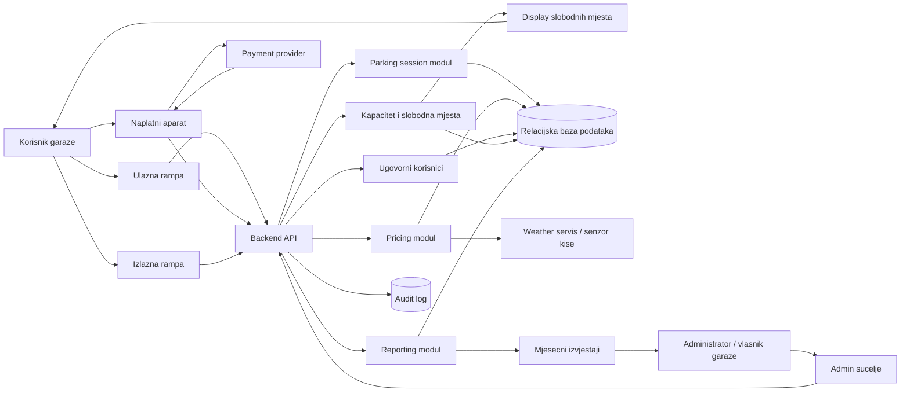
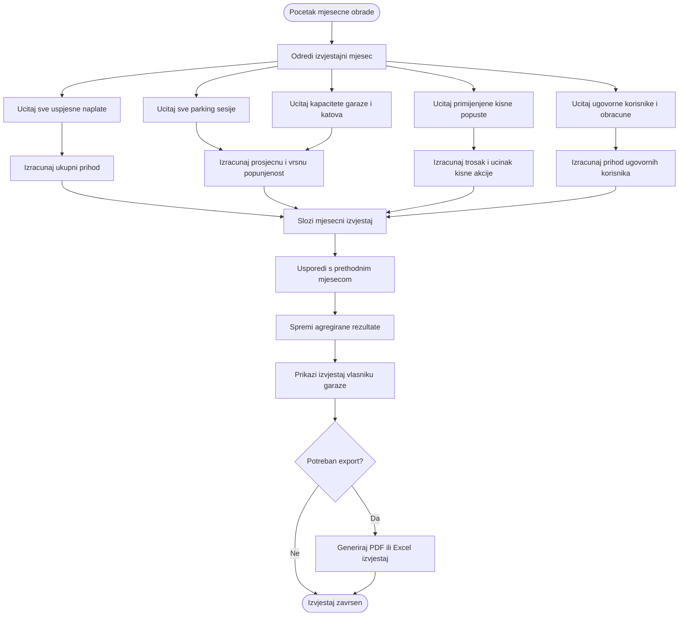
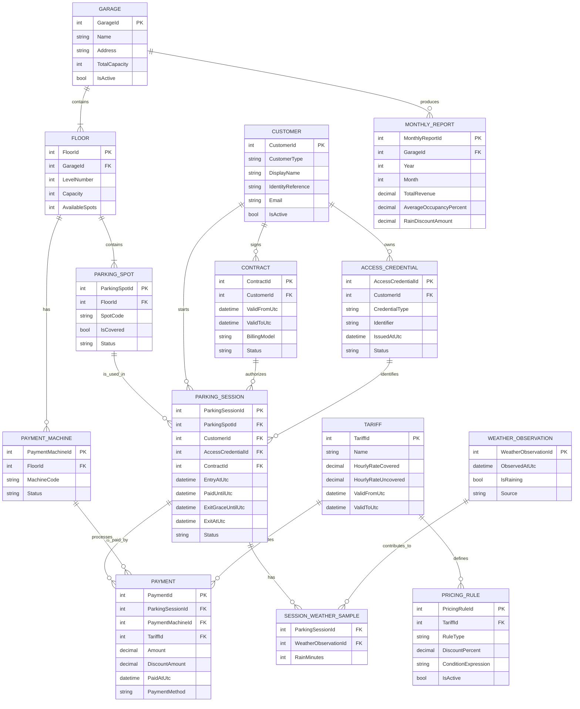

# Zadatak 2 - Sustav za vodjenje parkiralista

## Sadrzaj

- [Cilj sustava](#cilj-sustava)
- [Kljucni dijelovi sustava](#kljucni-dijelovi-sustava)
- [Prioriteti zahtjeva](#prioriteti-zahtjeva)
- [Kljucni procesi](#kljucni-procesi)
- [Otvorena pitanja i pretpostavke](#otvorena-pitanja-i-pretpostavke)
- [Potencijalni problemi i rizici](#potencijalni-problemi-i-rizici)
- [Arhitekturne odluke](#arhitekturne-odluke)
- [Predlozena logicka arhitektura](#predlozena-logicka-arhitektura)
- [Big picture arhitektura](#big-picture-arhitektura)
- [Proces ulaska, naplate i izlaska](#proces-ulaska-naplate-i-izlaska)
- [Obracun cijene i kisnog popusta](#obracun-cijene-i-kisnog-popusta)
- [Mjesecni reporting i poslovna analiza](#mjesecni-reporting-i-poslovna-analiza)
- [Idejni model baze podataka](#idejni-model-baze-podataka)
- [Pseudokod kljucnih procesa](#pseudokod-kljucnih-procesa)
- [Zakljucak](#zakljucak)

## Cilj sustava

Potrebno je osmisliti sustav za vodjenje garaze koji omogucuje naplatu parkiranja prema vremenu zauzetosti parkirnog mjesta, kontrolu ulaza i izlaza, pracenje slobodnih mjesta te mjesecni uvid u poslovanje garaze.

Sustav mora podrzavati placanje na naplatnim aparatima po katovima, ugovorne korisnike, zabranu placanja na izlazu, pravilo da korisnik ima 10 minuta za izlaz nakon placanja te posebnu akciju u kojoj su nenatkrivena mjesta u kisnim uvjetima 50% jeftinija ako je vozilo barem 33% parkiranog vremena bilo na kisi.

Najkriticniji dio sustava je naplata parkiranja. Funkcionalnosti poput kisne akcije i prikaza slobodnih mjesta po katu su korisne, ali ne smiju ugroziti stabilnost naplate, evidenciju ulaza/izlaza i osnovnu kontrolu pristupa.

## Kljucni dijelovi sustava

| Dio sustava | Odgovornost |
| --- | --- |
| Ulazna rampa | Identifikacija korisnika, provjera kapaciteta, otvaranje ulaza i kreiranje parking sesije. |
| Izlazna rampa | Provjera placanja, provjera roka od 10 minuta nakon placanja i zatvaranje parking sesije. |
| Naplatni aparat | Izracun cijene, provjera aktivne sesije, provedba placanja i izdavanje potvrde. |
| Backend/API | Centralna poslovna logika za sesije, naplatu, tarife, ugovore, kapacitete i izvjestaje. |
| Baza podataka | Trajna pohrana garaze, katova, mjesta, korisnika, sesija, uplata, tarifa i izvjestaja. |
| Modul za tarife | Pravila obracuna cijene, ugovorni modeli, popusti i buduce akcije. |
| Weather servis | Evidencija kisnih razdoblja za obracun popusta na nenatkrivenim mjestima. |
| Reporting modul | Mjesecni izvjestaji o prihodu, popunjenosti, ugovornim korisnicima i isplativosti akcija. |
| Admin sucelje | Upravljanje garazom, parkirnim mjestima, tarifama, ugovorima i pregled izvjestaja. |
| Display slobodnih mjesta | Prikaz ukupnog broja slobodnih mjesta i, po mogucnosti, slobodnih mjesta po katu. |

## Prioriteti zahtjeva

| Prioritet | Zahtjev | Obrazlozenje |
| --- | --- | --- |
| Kriticno | Naplata parkiranja | Prihod garaze i izlaz vozila ovise o ispravnoj naplati. |
| Kriticno | Evidencija ulaza i izlaza | Bez pouzdane sesije nije moguce tocno naplatiti parking. |
| Kriticno | Identitet korisnika | Klijent izricito trazi osiguranje identiteta korisnika garaze. |
| Visoko | Ukupan broj slobodnih mjesta | Potencijalnim korisnicima je vazno znati ima li mjesta u garazi. |
| Srednje | Broj slobodnih mjesta po katu | Korisno za navigaciju, ali nije primarni proces. |
| Srednje | Mjesecni izvjestaji | Vazno za vlasnika i poslovnu analizu rada garaze. |
| Nize | Kisna akcija | Korisna marketinska akcija, ali ne smije ugroziti osnovni proces naplate. |

## Kljucni procesi

1. Ulazak vozila u garazu i pokretanje parking sesije.
2. Evidencija zauzimanja parkirnog mjesta i azuriranje kapaciteta.
3. Obracun cijene prema trajanju parkiranja, tipu mjesta, tarifi i mogucim akcijama.
4. Placanje na naplatnom aparatu ili obracun prema ugovoru.
5. Izlazak iz garaze unutar 10 minuta nakon placanja.
6. Dodatna naplata ako korisnik zakasni s izlazom nakon placanja.
7. Prikupljanje podataka za mjesecne izvjestaje i poslovnu analizu.

## Otvorena pitanja i pretpostavke

Specifikacija ostavlja nekoliko detalja otvorenima. U nastavku su navedene pretpostavke koje se koriste za idejno rjesenje, uz pitanja koja bi trebalo potvrditi s klijentom prije detaljne implementacije.

| Tema | Pretpostavka / pitanje |
| --- | --- |
| Identifikacija korisnika | Pretpostavlja se da se korisnik identificira karticom, ticketom, QR kodom ili registarskom oznakom. Tocan mehanizam treba potvrditi. |
| Placanje na izlazu | Placanje na izlazu nije dopusteno. Izlazna rampa samo provjerava status placanja i rok za izlaz. |
| Ugovorni korisnici | Ugovorni korisnici mogu imati drugaciji model naplate, npr. mjesecni obracun, pretplatu ili dodijeljena prava pristupa. |
| Dodjela mjesta | Sustav moze pratiti tocno parkirno mjesto ili samo kat/zonu. Za kisni popust treba znati je li mjesto natkriveno. |
| Kisni podaci | Pretpostavlja se integracija s vremenskim servisom ili lokalnim senzorom kise. Potrebno je definirati izvor istine za kisne intervale. |
| Slobodna mjesta po katu | Prikaz po katu je pozeljan, ali nije kritican. Ukupan broj slobodnih mjesta ima veci prioritet. |
| Reporti | Potrebno je potvrditi zeljeni format izvjestaja, npr. dashboard, PDF, Excel ili automatska mjesecna e-mail dostava. |
| Vrste korisnika | Specifikacija spominje mogucnost vise vrsta korisnika, pa model treba omoguciti prosirenje bez promjene osnovne naplate. |

## Potencijalni problemi i rizici

| Rizik | Utjecaj | Predlozeno rjesenje |
| --- | --- | --- |
| Kvar naplatnog aparata | Korisnik ne moze platiti i ne moze izaci iz garaze. | Vise aparata po garazi, health-check aparata, fallback na drugi aparat i administrativni override uz audit log. |
| Nedostupnost payment providera | Naplata ne prolazi iako je sustav garaze ispravan. | Jasno stanje neuspjele naplate, ponovni pokusaj, evidentiranje transakcijskog statusa i zabrana otvaranja izlaza dok naplata nije potvrdena. |
| Nedostupnost centralnog backend-a | Ulaz, izlaz i naplata mogu stati. | Visoka dostupnost backend-a, lokalni cache minimalnih pravila na rampama/aparatima i sinkronizacija nakon oporavka. |
| Neispravan broj slobodnih mjesta | Korisnici dobivaju krivu informaciju o dostupnosti garaze. | Brojanje temeljiti na aktivnim sesijama, periodicna rekonsilijacija sa senzorima/rampama i rucna korekcija uz audit log. |
| Korisnik zakasni izaci nakon placanja | Nastaje spor oko dodatne naplate. | Jasno spremiti `PaidUntilUtc` i `ExitGraceUntilUtc`, prikazati rok na potvrdi i na izlazu traziti doplatu ako je rok istekao. |
| Nepouzdan weather servis | Kisni popust moze biti pogresno primijenjen. | Spremati vremenske uzorke u bazu, koristiti lokalni senzor ili pouzdan servis i omoguciti audit izracuna popusta. |
| Nejasan identitet korisnika | Tesko je dokazati tko koristi uslugu ili ugovor. | Uvesti jedinstveni access credential, povezati ga s korisnikom/ugovorom i logirati ulazne/izlazne dogadaje. |
| Zlouporaba kartice ili ticketa | Moguc neovlasteni izlaz ili prijenos prava pristupa. | Jedna aktivna sesija po credentialu, status credentiala, validacija na ulazu i izlazu te blokiranje sumnjivih stanja. |
| Promjena tarifa tijekom aktivne sesije | Moze nastati nejasan obracun cijene. | Verzionirati tarife i spremiti referencu na tarifu/ruleset koji vrijedi za obracun sesije. |
| GDPR i osobni podaci | Identitet korisnika i ugovori mogu ukljucivati osobne podatke. | Minimalna pohrana osobnih podataka, kontrola pristupa, audit log i definirani rokovi cuvanja podataka. |
| Mjesecni reporti koriste nepotpune podatke | Vlasnik dobiva pogresnu poslovnu sliku. | Reporte graditi iz zakljucanih uplata i zatvorenih sesija, oznaciti nepotpune podatke i cuvati agregirane rezultate. |
| Buduce akcije osim kisne | Hardkodirana kisna akcija otezava prosirenje. | Uvesti modul za pricing rules kako bi se kasnije dodale nove akcije bez promjene osnovnog procesa naplate. |

## Arhitekturne odluke

| Odluka | Razlog |
| --- | --- |
| Centralni backend je izvor istine za parking sesije | Ulaz, izlaz, naplata i kapaciteti moraju koristiti isti status sesije kako ne bi nastali konflikti. |
| Naplata je izdvojena kao najkriticniji proces | Proces placanja mora biti stabilan, auditabilan i neovisan o manje kriticnim funkcijama poput reportinga ili prikaza po katu. |
| Pricing modul koristi verzionirane tarife i pravila | Tarife i akcije se mogu mijenjati kroz vrijeme, a svaka naplata mora biti objasnjiva i ponovljivo izracunljiva. |
| Kisna akcija je pricing rule, a ne poseban tok naplate | Time se omogucuje dodavanje buducih akcija bez mijenjanja osnovnog procesa placanja. |
| Weather podaci se spremaju lokalno u bazu | Obracun kisnog popusta mora se moci dokazati i nakon sto vanjski servis vise ne vraca stare podatke. |
| Izlazna rampa ne provodi placanje | Klijent ne zeli placanje na izlazu, pa izlazna rampa samo provjerava je li sesija placena i je li rok za izlaz valjan. |
| Slobodna mjesta se racunaju iz aktivnih sesija i korekcija | Ukupan broj slobodnih mjesta je vazan, ali treba imati mehanizam korekcije zbog senzora, rampi i iznimnih situacija. |
| Reporting koristi agregirane i zakljucene podatke | Poslovni izvjestaji ne bi trebali opterecivati kriticni dio sustava niti mijenjati povijesne rezultate nakon zakljucenja mjeseca. |
| Administrativne intervencije zahtijevaju audit log | Rucno otvaranje rampe, korekcija kapaciteta ili storniranje naplate mora biti vidljivo i povezano s korisnikom koji je akciju napravio. |
| Sustav se projektira modularno | Razdvajanje rampi, naplate, tarife, weather integracije i reportinga smanjuje rizik da sporedni feature ugrozi naplatu. |

## Predlozena logicka arhitektura

Rjesenje se moze promatrati kao modularna aplikacija s centralnim backend/API slojem i relacijskom bazom podataka. Ulazna rampa, izlazna rampa i naplatni aparati komuniciraju s backendom preko API-ja. Backend upravlja parking sesijama, validira identitet korisnika, provodi pricing pravila, evidentira uplate i azurira kapacitet garaze.

Reporting i weather integracija su podrzavajuci moduli. Oni daju dodatnu poslovnu vrijednost, ali ne smiju blokirati osnovne procese ulaza, placanja i izlaza. Ako weather servis trenutno nije dostupan, sustav i dalje mora moci naplatiti parking po osnovnoj tarifi, uz jasno evidentiranje da kisni popust nije mogao biti automatski potvrden.

## Big picture arhitektura



## Proces ulaska, naplate i izlaska


## Obracun cijene i kisnog popusta


## Mjesecni reporting i poslovna analiza



## Idejni model baze podataka


## Pseudokod kljucnih procesa

### Pokretanje parking sesije

```text
function StartParkingSession(accessIdentifier, entryGateId):
    credential = FindActiveCredential(accessIdentifier)
    if credential is null:
        return DenyEntry("Identitet korisnika nije valjan")

    garage = GetGarageByEntryGate(entryGateId)
    if garage.AvailableSpots <= 0:
        return DenyEntry("Garaza je puna")

    contract = FindValidContract(credential.CustomerId, nowUtc)
    spot = AssignAvailableSpot(garage.Id, preferredFloor = null)

    session = new ParkingSession
    session.CustomerId = credential.CustomerId
    session.AccessCredentialId = credential.Id
    session.ContractId = contract?.Id
    session.ParkingSpotId = spot.Id
    session.EntryAtUtc = nowUtc
    session.Status = "Active"

    Save(session)
    MarkSpotAsOccupied(spot.Id)
    DecreaseAvailableCapacity(spot.FloorId)
    OpenEntryGate(entryGateId)

    return AllowEntry(session.Id)
```

### Obracun cijene parkiranja

```text
function CalculateParkingPrice(sessionId, paymentTimeUtc):
    session = GetActiveSession(sessionId)
    if session is null:
        throw "Parking sesija nije aktivna"

    tariff = GetValidTariff(paymentTimeUtc)
    spot = GetParkingSpot(session.ParkingSpotId)

    parkedMinutes = MinutesBetween(session.EntryAtUtc, paymentTimeUtc)
    billableHours = RoundUpToBillableHours(parkedMinutes, tariff)

    if spot.IsCovered:
        baseAmount = billableHours * tariff.HourlyRateCovered
        discountAmount = 0
        appliedRule = null
    else:
        baseAmount = billableHours * tariff.HourlyRateUncovered
        discount = ApplyRainDiscount(session, paymentTimeUtc, baseAmount)
        discountAmount = discount.Amount
        appliedRule = discount.RuleCode

    totalAmount = baseAmount - discountAmount

    return PricePreview(
        baseAmount = baseAmount,
        discountAmount = discountAmount,
        totalAmount = totalAmount,
        tariffId = tariff.Id,
        appliedRule = appliedRule
    )
```

### Primjena kisnog popusta

```text
function ApplyRainDiscount(session, paymentTimeUtc, baseAmount):
    spot = GetParkingSpot(session.ParkingSpotId)
    if spot.IsCovered:
        return NoDiscount()

    totalMinutes = MinutesBetween(session.EntryAtUtc, paymentTimeUtc)
    rainMinutes = CountRainMinutes(session.EntryAtUtc, paymentTimeUtc)

    if totalMinutes <= 0:
        return NoDiscount()

    rainRatio = rainMinutes / totalMinutes

    if rainRatio >= 0.33:
        return Discount(
            ruleCode = "RAIN_UNCOVERED_50",
            amount = baseAmount * 0.50
        )

    return NoDiscount()
```

### Provedba placanja

```text
function ProcessPayment(sessionId, paymentMachineId, paymentMethod):
    session = GetActiveSession(sessionId)
    if session is null:
        return PaymentRejected("Parking sesija nije aktivna")

    price = CalculateParkingPrice(sessionId, nowUtc)
    transaction = PaymentProvider.Charge(paymentMethod, price.TotalAmount)

    if transaction.Status != "Approved":
        SaveFailedPaymentAttempt(sessionId, paymentMachineId, transaction)
        return PaymentRejected("Naplata nije uspjela")

    payment = new Payment
    payment.ParkingSessionId = sessionId
    payment.PaymentMachineId = paymentMachineId
    payment.TariffId = price.TariffId
    payment.Amount = price.TotalAmount
    payment.DiscountAmount = price.DiscountAmount
    payment.PaidAtUtc = nowUtc
    payment.PaymentMethod = paymentMethod
    payment.ProviderTransactionId = transaction.Id

    Save(payment)

    session.PaidUntilUtc = nowUtc
    session.ExitGraceUntilUtc = nowUtc + 10 minutes
    session.Status = "Paid"
    Save(session)

    return PaymentAccepted(payment.Id, session.ExitGraceUntilUtc)
```

### Provjera izlaza iz garaze

```text
function ValidateExit(accessIdentifier, exitGateId):
    credential = FindActiveCredential(accessIdentifier)
    if credential is null:
        return DenyExit("Identitet korisnika nije valjan")

    session = FindOpenSessionByCredential(credential.Id)
    if session is null:
        return DenyExit("Nema aktivne parking sesije")

    if session.ContractId is not null and IsContractValid(session.ContractId, nowUtc):
        CloseParkingSession(session, exitGateId)
        return AllowExit()

    if session.Status != "Paid":
        return DenyExit("Parking nije placen")

    if nowUtc > session.ExitGraceUntilUtc:
        session.Status = "PaymentExpired"
        Save(session)
        return DenyExit("Istekao je rok od 10 minuta nakon placanja")

    CloseParkingSession(session, exitGateId)
    return AllowExit()
```

### Zatvaranje parking sesije

```text
function CloseParkingSession(session, exitGateId):
    session.ExitAtUtc = nowUtc
    session.Status = "Closed"
    Save(session)

    MarkSpotAsAvailable(session.ParkingSpotId)
    IncreaseAvailableCapacityBySpot(session.ParkingSpotId)
    OpenExitGate(exitGateId)

    WriteAuditLog(
        action = "ParkingSessionClosed",
        sessionId = session.Id,
        timestampUtc = nowUtc
    )
```

### Generiranje mjesecnog izvjestaja

```text
function GenerateMonthlyReport(garageId, year, month):
    period = GetMonthPeriod(year, month)

    payments = GetApprovedPayments(garageId, period)
    sessions = GetParkingSessions(garageId, period)
    capacity = GetGarageCapacity(garageId)
    rainDiscounts = SumDiscounts(payments, ruleCode = "RAIN_UNCOVERED_50")

    totalRevenue = Sum(payments.Amount)
    totalSessions = Count(sessions)
    averageDuration = AverageMinutes(sessions.EntryAtUtc, sessions.ExitAtUtc)
    occupancy = CalculateAverageOccupancy(sessions, capacity, period)
    peakOccupancy = CalculatePeakOccupancy(sessions, capacity, period)

    report = new MonthlyReport
    report.GarageId = garageId
    report.Year = year
    report.Month = month
    report.TotalRevenue = totalRevenue
    report.TotalSessions = totalSessions
    report.AverageParkingDurationMinutes = averageDuration
    report.AverageOccupancyPercent = occupancy
    report.PeakOccupancyPercent = peakOccupancy
    report.RainDiscountAmount = rainDiscounts
    report.GeneratedAtUtc = nowUtc

    Save(report)
    return report
```

## Zakljucak

Predlozeno rjesenje razdvaja kriticne procese naplate, ulaza i izlaza od podrzavajucih funkcionalnosti kao sto su kisna akcija, prikaz slobodnih mjesta po katu i mjesecni reporting. Time se smanjuje rizik da dodatne funkcionalnosti utjecu na osnovnu dostupnost garaze i naplatu parkiranja.

Najvazniji dio sustava je pouzdana parking sesija koja povezuje identitet korisnika, vrijeme ulaska, parkirno mjesto, naplatu i izlaz. Na toj sesiji se temelje obracun cijene, provjera roka od 10 minuta nakon placanja, kapacitet garaze i poslovni izvjestaji.

Za detaljnu implementaciju potrebno je s klijentom potvrditi odabrani nacin identifikacije korisnika, izvor podataka o kisi, format mjesecnih reporta i pravila za ugovorne korisnike. Arhitektura je zato namjerno postavljena modularno kako bi podrzala buduca pravila naplate i nove vrste korisnika bez promjene osnovnog procesa.
