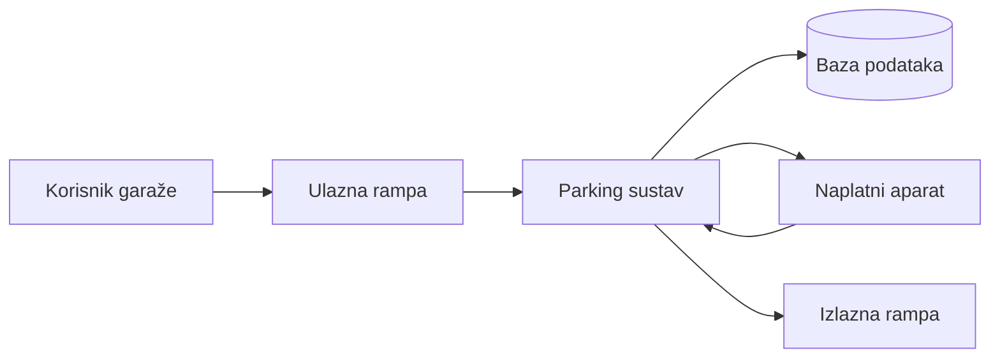
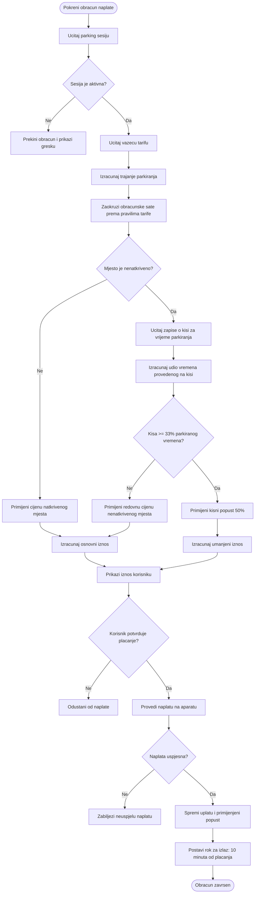
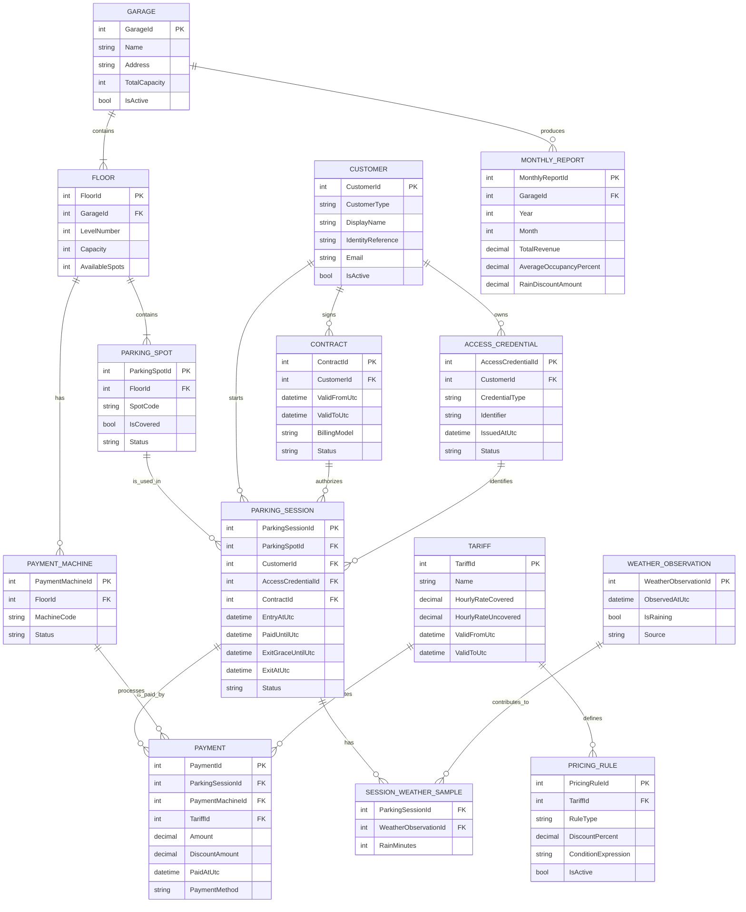

## Big picture arhitektura

https://mermaid.live

## Proces ulaska, naplate i izlaska

## Obracun cijene i kisnog popusta

## Mjesecni reporting i poslovna analiza

## Idejni model baze podataka

